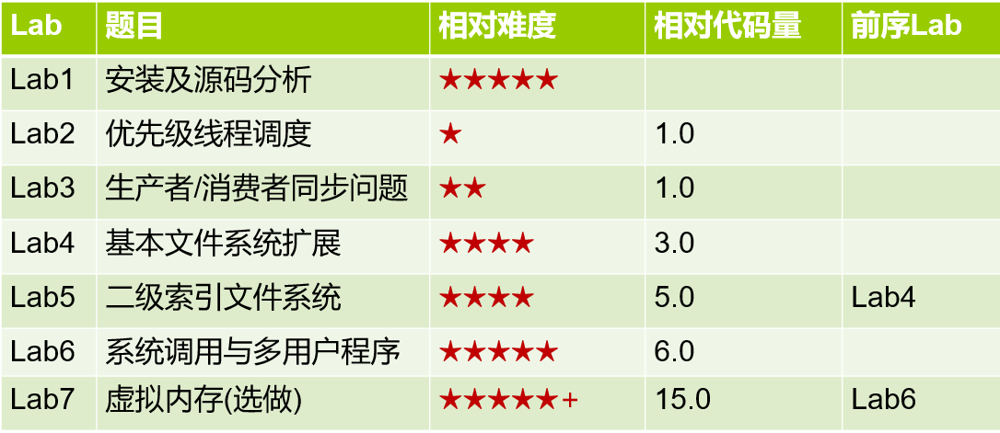

对 Nachos-3.4-ualr 这个教学操作系统的功能的一些扩展，下含七个实验

 博主与舍友合作完成，舍友主要负责文件系统部分。

对于实验有疑惑的同学可以看根目录下的实验指北

# 

### 实验1 Nachos实验环境准备、安装与源码分析(Lab1)

实验内容：

1. 准备Linux宿主操作系统环境；
2. Nachos实验代码框架（源码目录）的基本分析；
3. Makefile的基本分析；
4. 硬件机制模拟部分的实现原理分析，包括中断、时钟、CPU指令执行。

注意：实验1没有代码的编写、演示验收及提交，因此分数完全来自于以上4部分实验内容在实验报告中的撰写质量情况。

### 实验2 具有优先级的线程调度(Lab2)

实验内容：

1. 熟悉Nachos原有的线程调度策略；
2. 设计并实现具有静态优先级的非抢占式线程调度策略。提示：List类中已有的SortedInsert方法可加以利用。

### 实验3 使用信号量解决生产者/消费者同步问题(Lab3)

实验内容：
使用操作系统信号量机制，编写程序解决生产者/消费者同步问题。包括：

1. 理解Nachos的信号量是如何实现的；
2. 生产者/消费者问题是如何用信号量实现的；
3. 在Nachos中是如何创建并发线程的；
4. 在Nachos下是如何测试和debug的。

### 实验4 扩展文件系统(Lab4)

实验内容：扩展Nachos的基本文件系统。Nachos的文件系统是一个简单并且能力有限的系统，限制之一就是文件的大小是不可扩展的。通过扩展，使得文件的大小是可变的。在扩展写入文件内容时，一边写入，一边动态调整文件的长度及所占用的数据扇区。
提示：对一般的OS，一个100字节的文件，open后lseek到偏移50处，write 10字节，close后，文件长度还是100字节，不会截短到60字节。这在实现Nachos的-hap命令行选项时需要注意。

### 实验5 具有二级索引的文件系统(Lab5)

实验内容：Nachos系统原有的文件系统只支持单级索引，最大能存取NumDirect * SectorSize = 30 * 128 = 3840字节大小的文件。本实验将在理解原文件系统的组织结构基础上扩展原有的文件系统，设计并实现具有二级索引的文件系统。

二级索引文件头i-node设计：

如上图所示，构建具有二级索引的i-node，原先的前NumDirect-1项还是直接索引，最后一项(数组下标为NumDirect-1)指向一个二级索引块，这个块存放新的索引条目，共NumDirect+2项(数组下标0~NumDirect+1)。扩大后的文件最大长度为（29 + 32）* 128 = 7808字节。

二级索引块是动态产生的，当文件大小不需要它时，一级索引块的最后一项设置为-1，此时不存在二级索引块。当文件大小增长到一级索引无法支持时，再分配一个新的块存二级索引，并将其扇区号存入一级索引块的最后一项，形成上图所示的结构。

### 实验6  系统调用与多道用户程序(Lab6)

实验内容：

1. 扩展现有的class AddrSpace的实现，使得Nachos可以实现多道用户程序。

2. 按照实验指导书中的方法，完成class AddrSpace中的Print函数。

3. 实现Nachos 系统调用：Exec()。

### 实验7  虚拟内存(Lab7)

实验内容：
在未实现虚拟内存管理之前，Nachos在运行一个用户进程的时候，需要将程序运行所需所有内存空间一次性分配。虚拟内存实现将突破物理内存限制。本实验核心任务为根据理论学习中涉及的对换（Swapping）技术，设计并实现用户空间的虚拟内存管理。
页置换算法可以采用FIFO、二次机会、增强型二次机会、LRU等算法之一，或自己认为合适的其他算法。
